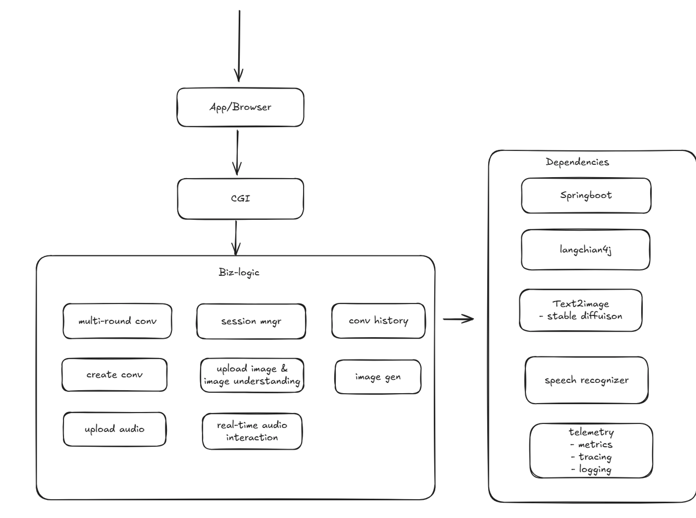

# Prerequisite
## JDK
We recommend [BellSoft Liberica JDK](https://bell-sw.com/pages/downloads/#/java-17-lts) version 17.
## Maven
https://maven.apache.org/download.cgi
## Env
```bash
export JAVA_HOME=/path/to/your/jdk-17.0.13
export PATH=$PATH:$JAVA_HOME/bin

export MAVEN_HOME=/path/to/your/apache-maven-3.9.9
export PATH=$PATH:$MAVEN_HOME/bin
```

# Setup chatbot
## step 1
git clone git@github.com:aitinytang/chatbot.git

## step 2
cd chatbot

## step 3
```bash
mvn clean spring-boot:run
```
> tips: if 8080 has corrupied by other app: window: netstat -ano | findstr :8080; linux: netstat -tnlp | grep 8080, then kill the pid

## step 4
open your brower and type: http://localhost:8080, then you can message chatbot

# Reference
[1. langchain4j azure open ai](https://docs.langchain4j.dev/integrations/language-models/azure-open-ai/) <br>
[2. langchan4j](https://github.com/langchain4j/langchain4j) <br>
[3. springboot](https://spring.io/quickstart) <br>
[4. azure open ai](https://learn.microsoft.com/en-us/azure/ai-services/openai/) <br>

# Architectrue Overview

